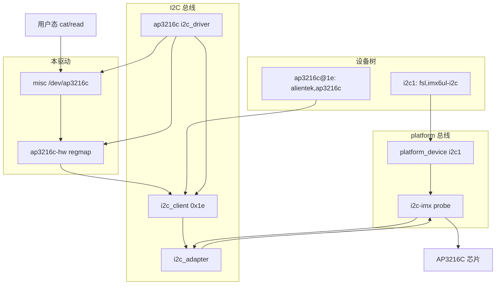

# AP3216C：从芯片到 `/dev/ap3216c` 的数据链路

本文说明：为什么板子上会出现 `/dev/ap3216c`，以及 `cat` / `ap3216c-read` / dashboard 读到的 `ir=… als=… ps=…` 是怎么来的。

---

## 一句话结论（展开）

### 1）设备节点名字：谁决定叫 `/dev/ap3216c`？

由驱动在 `probe` 里填写的 **`miscdevice.name`** 决定，本驱动为宏 `AP3216C_DRV_NAME`（字符串 `"ap3216c"`）：

```c
data->miscdev.name = AP3216C_DRV_NAME;  /* "ap3216c" */
data->miscdev.minor = MISC_DYNAMIC_MINOR;
misc_register(&data->miscdev);
```

misc 子系统注册成功后，会在 `/dev` 下创建与 `name` 同名的节点，即 **`/dev/ap3216c`**。

需要分清的几件事：

| 名字 | 作用 | 是否等于 `/dev` 名 |
|------|------|-------------------|
| DT 节点名 `ap3216c@1e` | 人读设备树用 | **否** |
| `compatible = "alientek,ap3216c"` | 匹配驱动 | **否**（只决定绑哪个驱动） |
| 模块名 `ap3216c.ko` / `modprobe ap3216c` | 加载驱动 | **否**（通常碰巧同名） |
| `miscdevice.name = "ap3216c"` | 创建设备节点 | **是** → `/dev/ap3216c` |

若改成 `name = "light"`，节点就会变成 `/dev/light`，同时用户态（`ap3216c-read`、logger、`DASHBOARD_AP_DEV`）都要改路径。

次设备号用 `MISC_DYNAMIC_MINOR`，由内核分配；用户一般只关心路径，不关心主/次设备号（misc 主设备号通常为 10）。

---

### 2）节点何时出现：什么条件凑齐才会有这个文件？

`/dev/ap3216c` **不是** 编进 rootfs 的静态文件，而是 **运行时** 由驱动创建。出现条件可看成一条链，任一环失败都不会有节点（或会马上消失）：

```
① 镜像里装了 ap3216c.ko，且开机自动加载
        （KERNEL_MODULE_AUTOLOAD += "ap3216c"）
        │
② 设备树里有启用的节点，且 compatible 与驱动一致
        ap3216c@1e { compatible = "alientek,ap3216c"; reg = <0x1e>; }
        │  I2C 核心为该地址创建 i2c_client，按 compatible 找驱动
        ▼
③ 驱动 of_match 命中 → 调用 ap3216c_probe()
        │
④ probe 内硬件初始化成功（复位 / 使能 / 读回校验 / 试读）
        │  失败则直接 return，不会 register
        ▼
⑤ misc_register() 成功 → 内核创建 /dev/ap3216c
```

因此：

- **模块没加载**（`lsmod` 无 `ap3216c`）→ 无节点  
- **DT 没有 / compatible 写错 / status=disabled** → 有模块也不 probe 这颗芯片 → 无节点  
- **I2C 无应答、init 失败** → probe 失败，打 `dmesg` 错误 → 无节点  
- **`misc_register` 失败**（极少见）→ 同样无节点  

卸载模块或 `remove` 时会先 `misc_deregister`，节点随之消失。

自检：

```bash
lsmod | grep ap3216c
dmesg | grep -i ap3216c
ls -l /dev/ap3216c
```

---

### 3）你看到的数据内容：那一行文本是怎么来的？

芯片本身只提供 **寄存器里的原始数值**，不会输出字符串。用户态 `cat /dev/ap3216c` 看到的一行，是驱动 **`read()` 回调**里拼出来的：

1. 用户态 `open` + `read` → 进入 `ap3216c_misc_read`（`ap3216c-misc.c`）  
2. 持锁调用 `ap3216c_read_values`（`ap3216c-hw.c`）  
3. 从数据区起始寄存器 `0x0A` 起 **逐字节** 读 6 个寄存器（IR/ALS/PS）  
4. 按手册位域解析成三个 `u16`：`ir` / `als` / `ps`  
   - IR：低字节 bit7 为无效时保留上次有效值（避免 0↔大数乱跳）  
   - PS：低字节 bit6 同理  
5. 用固定格式写入缓冲区并 `copy_to_user`：

```text
ir=<无符号整数> als=<无符号整数> ps=<无符号整数>\n
```

对应代码大意：

```c
scnprintf(buf, sizeof(buf), "ir=%u als=%u ps=%u\n", ir, als, ps);
```

因此：

- **数值含义**：寄存器 ADC 计数（不是已经换算好的 lux）；换算要另做  
- **字符串长相**：驱动 ABI，改格式必须同步改 `ap3216c-read` / logger / dashboard 解析  
- **读一次就 EOF**：`*ppos != 0` 时再 `read` 返回 0；循环读需 `lseek(0, SEEK_SET)`（`ap3216c-read -w` 已处理）

---

## 总览（端到端）

```
硬件 AP3216C (I2C1 @ 0x1e)
        │
        ▼
设备树：ap3216c@1e { compatible = "alientek,ap3216c"; reg = <0x1e>; }
        │  内核启动解析 DT，I2C 核心按 compatible 找驱动
        ▼
内核模块 ap3216c.ko（KERNEL_MODULE_AUTOLOAD）
        │  of_match → probe
        │  regmap 初始化芯片 → misc_register
        ▼
字符设备 /dev/ap3216c   （misc，动态次设备号）
        │  用户态 open + read
        ▼
驱动 ap3216c_misc_read()
        │  逐字节读 0x0A..0x0F → 解析 IR/ALS/PS
        │  写出 "ir=%u als=%u ps=%u\n"
        ▼
ap3216c-read / ap3216c-logger / dashboard（默认 DASHBOARD_AP_DEV=/dev/ap3216c）
```

---

## 完整调用链（含 platform / i2c-imx）

本驱动是 **`i2c_driver`**，代码里不直接调用 `platform_*`。  
但 I2C1 **控制器**由内核 `drivers/i2c/busses/i2c-imx.c` 以 **platform 驱动** probe，再注册成 `i2c_adapter`。  
因此：**完整链路上有 platform，只出现在主机适配器层；从设备（AP3216C）挂在 I2C 总线上。**

分层对照：

| 层级 | 文件 / 组件 | 总线 / 框架 |
|------|-------------|-------------|
| 用户接口 | `ap3216c-misc.c` → `/dev/ap3216c` | misc |
| 芯片逻辑 | `ap3216c-hw.c`（regmap、解析、缓存） | regmap |
| 从设备驱动 | `ap3216c-i2c.c`（`module_i2c_driver`） | **I2C**（`i2c_client`） |
| 主机适配器 | 内核 `i2c-imx.c` | **platform** → 暴露为 `i2c_adapter` |
| 硬件 | I2C1 @ `0x021a0000`，芯片 @ `0x1e` | SoC + SCL/SDA |

### A. 启动绑定链（节点从哪来）

```
设备树
  imx6ul.dtsi: i2c1@21a0000
    compatible = "fsl,imx6ul-i2c", "fsl,imx21-i2c"
  alientek-alpha.dtsi: &i2c1 { status = "okay";
    ap3216c@1e { compatible = "alientek,ap3216c"; reg = <0x1e>; }
  }
        │
        ▼
of_platform_populate / 总线枚举
        │
        ▼
platform 核心：创建 platform_device（I2C1 控制器）
        │  匹配 of_device_id（优先 fsl,imx6ul-i2c → imx6_i2c_hwdata）
        ▼
i2c-imx.c: i2c_imx_probe(struct platform_device *pdev)
        │  i2c_add_numbered_adapter() → 注册 i2c_adapter（如 i2c-0）
        ▼
I2C 核心：扫描 DT 子节点，创建 i2c_client（addr=0x1e）
        │  of_match: "alientek,ap3216c"
        ▼
本模块: ap3216c_probe(struct i2c_client *client)   ← ap3216c-i2c.c
        │  ap3216c_hw_init()
        │    └─ devm_regmap_init_i2c()
        │    └─ regmap_write(复位/使能) … → 与下方「读数链」同路径下总线
        │  misc_register() → /dev/ap3216c
        ▼
就绪
```

说明：`i2c-imx.c` 里还有旧式 `platform_device_id` 名字（如 `imx1-i2c` / `imx21-i2c`），那是给非 DT / 旧平台设备用的；本板走 DT 的 `fsl,imx6ul-i2c`，实际绑定 `imx6_i2c_hwdata`，与传感器驱动无关。

### B. 运行时读数链（`cat /dev/ap3216c`）

```
用户态
  open("/dev/ap3216c") → read()
        │
        ▼
VFS / misc
  file_operations.read
        │
        ▼
ap3216c-misc.c
  ap3216c_misc_read()
    mutex_lock
    ap3216c_read_values()          ← ap3216c-hw.c
      │  （距上次采样不足约 120ms：直接返回缓存，不再下总线）
      │
      ▼
    ap3216c_read_data_regs()
      for 寄存器 0x0A..0x0F:
        regmap_read(map, reg, &val)   ← use_single_read=true，一次一字节
        │
        ▼
regmap I2C 后端
  → i2c_transfer() / __i2c_transfer()
        │  msgs: [写寄存器地址] + [读 1 字节]
        ▼
I2C 核心
  adapter->algo→xfer
        │
        ▼
i2c-imx.c（platform 驱动注册的算法）
  i2c_imx_xfer()
    → i2c_imx_xfer_common()
      → 读写 I2C1 控制器寄存器（0x021a0000）
        │
        ▼
硬件
  SCL/SDA → AP3216C@0x1e
        │
        ▼（数据原路返回）
ap3216c_parse_ir / als / ps → 拼 "ir=%u als=%u ps=%u\n"
  copy_to_user → 用户态
```

写配置（probe 复位/使能，或 remove 关机）路径相同，只是 `regmap_write` 代替 `regmap_read`。

### C. 关系示意



一句话：**你的代码从 `i2c_client` 往上；再往下穿过 I2C 核心到达 `i2c-imx`（platform），最后到硬件。**

---

## 1. 硬件与总线地址

- 芯片：AP3216C（红外 IR、环境光 ALS、接近 PS）
- 挂在 **I2C1**，7 位地址 **0x1e**（与部分 EVK 磁力计地址冲突，本板已用 AP 替换）

地址写在设备树 `reg = <0x1e>`，对应驱动里 `client->addr`。

---

## 2. 设备树：告诉内核「总线上有这颗芯片」

路径：`recipes-bsp/device-tree/alientek-aes/imx6ull-alientek-alpha.dtsi`（i2c1 节点下）

```dts
ap3216c@1e {
    compatible = "alientek,ap3216c";
    reg = <0x1e>;
};
```

要点：

| 字段 | 作用 |
|------|------|
| `compatible` | 与驱动 `of_device_id` 匹配；**匹配成功才会 probe** |
| `reg` | I2C 从地址 |
| 节点名 `ap3216c@1e` | 仅便于人读；**不决定** `/dev` 文件名 |

没有这条 DT（或 `status = "disabled"`），就不会有对应的 I2C client，模块即使加载也不会为该芯片创建 `/dev/ap3216c`。

---

## 3. 内核模块：谁创建 `/dev/ap3216c`

### 3.1 模块如何进镜像并自动加载

- Recipe：`recipes-kernel/modules/ap3216c/ap3216c-module_1.0.bb`
- `KERNEL_MODULE_AUTOLOAD += "ap3216c"` → 开机自动 `modprobe ap3216c`
- 包进 `packagegroup-alientek-core`（经依赖链随镜像安装）

源码拆分（仍链成一个 `ap3216c.ko`）：

| 文件 | 职责 |
|------|------|
| `ap3216c-i2c.c` | `compatible` 匹配、probe/remove、`misc_register` |
| `ap3216c-hw.c` | regmap、复位/使能、读寄存器、解析 |
| `ap3216c-misc.c` | `file_operations`（`read` / `llseek`） |
| `ap3216c.h` | 公共结构与接口 |

### 3.2 匹配与 probe

驱动声明：

```c
{ .compatible = "alientek,ap3216c" }
```

须与 DT **字符串完全一致**。匹配后进入 `ap3216c_probe()`：

1. 分配 `struct ap3216c_data`
2. `ap3216c_hw_init()`：`devm_regmap_init_i2c` → 软复位 → 使能 → 读回校验 → 试读一帧
3. 填充 `miscdevice`：
   - `name = "ap3216c"` ← **决定设备节点名为 `/dev/ap3216c`**
   - `fops = &ap3216c_fops`
   - `minor = MISC_DYNAMIC_MINOR`（次设备号由内核分配）
4. `misc_register()` → 在 `/dev` 下创建设备节点

因此：

- **看到 `/dev/ap3216c`** = probe 成功 + misc 注册成功  
- **名字是 `ap3216c` 而不是别的** = 代码里写死的 `AP3216C_DRV_NAME`，**不是** DT 节点名自动映射

misc 设备通常挂在主设备号 10（`MISC_MAJOR`）下，次设备号动态分配；用户一般只关心路径 `/dev/ap3216c`。

### 3.3 remove

卸载模块或设备移除时：先 `misc_deregister`（节点消失），再写寄存器关机。

---

## 4. 读一次数据时发生了什么

用户态：

```bash
cat /dev/ap3216c
# 或
ap3216c-read
```

内核路径（`ap3216c-misc.c` → `ap3216c-hw.c`）：

1. `open("/dev/ap3216c")` → 绑定到已注册的 `ap3216c_fops`
2. `read()` → `ap3216c_misc_read`
   - 仅当 `*ppos == 0` 时真正采样；再次 read 返回 0（EOF）
   - 循环读需 `lseek(fd, 0, SEEK_SET)`（`ap3216c-read -w` 即如此）
3. 持 `mutex`，调用 `ap3216c_read_values`
4. 对 `0x0A..0x0F` **逐寄存器** `regmap_read`（`use_single_read`；勿用 bulk/块读，本芯片会错位）
5. 按手册位域解析 `ir` / `als` / `ps`（IR/PS 无效位为 1 时保留上次有效值；未满转换周期则直接返回缓存）
6. `scnprintf(..., "ir=%u als=%u ps=%u\n", ...)` 拷到用户缓冲区

**你在终端看到的字符串格式是驱动约定的 ABI**，不是芯片「原生文本」。  
用户态解析（logger、dashboard）都依赖这一行格式，改格式需同步改应用。

---

## 5. 用户态谁在用这条链路

| 组件 | 路径 / 配置 | 用途 |
|------|-------------|------|
| `ap3216c-read` | 固定 `/dev/ap3216c` | 命令行单次/循环读 |
| `ap3216c-logger` | 默认 `/dev/ap3216c`（可用环境变量改） | 定时入库 SQLite |
| `dashboard` | 默认 `DASHBOARD_AP_DEV=/dev/ap3216c` | LCD 光感页 |
| Web / 历史查询 | 读 logger 的数据库，不直接读 `/dev` | 浏览器展示历史 |

验证示例：

```bash
ls -l /dev/ap3216c
cat /dev/ap3216c
ap3216c-read
ap3216c-read -w    # 循环；内部会 seek 回文件头
```

---

## 6. 「是谁决定的」对照表

| 现象 | 由谁决定 |
|------|----------|
| 芯片接在哪条总线、地址多少 | 原理图 + DT `reg` / 父节点 `i2c1` |
| 会不会加载本驱动 | DT `compatible` ↔ 驱动 `of_device_id` |
| `/dev` 下叫什么名字 | `miscdevice.name`（`AP3216C_DRV_NAME`） |
| 主/次设备号 | misc 子系统（动态次设备号） |
| 读出来长什么样 | `ap3216c_misc_read` 的 `scnprintf` 格式 |
| 开机有没有节点 | 模块是否自动加载 + probe 是否成功 |
| 应用打开哪个路径 | 各程序写死的路径或环境变量 |

---

## 7. 排障速查

| 症状 | 可能原因 |
|------|----------|
| 没有 `/dev/ap3216c` | 模块未加载；DT 无节点/compatible 不一致；probe 失败（I2C 无应答、init 校验失败） |
| 有节点但 read 报错 | 总线错误；芯片掉电；并发异常（少见） |
| 一直 `ir=0 als=0 ps=0` | 光照/遮挡；寄存器无效位；接线/地址错但偶发能通信 |
| 改了 DT 节点名但 `/dev` 名不变 | **正常**：节点名不影响 misc 名 |

有用命令：

```bash
lsmod | grep ap3216c
dmesg | grep -i ap3216c
ls -l /sys/bus/i2c/devices/   # 查看 i2c 客户端
cat /sys/bus/i2c/devices/*/name
```

---

## 8. 相关源码索引

| 环节 | 路径 |
|------|------|
| 设备树（板级 I2C1 + AP） | `meta-alientek/recipes-bsp/device-tree/alientek-aes/imx6ull-alientek-alpha.dtsi` |
| 设备树（I2C 控制器 SoC） | 内核 `arch/arm/boot/dts/nxp/imx/imx6ul.dtsi`（`i2c1` 等） |
| I2C 主机适配器（platform） | 内核 `drivers/i2c/busses/i2c-imx.c` |
| 本驱动 | `meta-alientek/recipes-kernel/modules/ap3216c/files/` |
| 模块 recipe | `meta-alientek/recipes-kernel/modules/ap3216c/ap3216c-module_1.0.bb` |
| 命令行读 | `meta-alientek/recipes-apps/sensors/ap3216c/files/src/ap3216c-read.c` |
| 入库 | `.../ap3216c-logger.c` |
| 仪表盘 | `recipes-apps/board-ui/dashboard/`（`DASHBOARD_AP_DEV`） |

---

*文档对应当前树：misc + regmap 单字节读 + 拆分实现；完整调用链含 i2c-imx（platform）；用户态 ABI 为单行 `ir=%u als=%u ps=%u\n`。*
